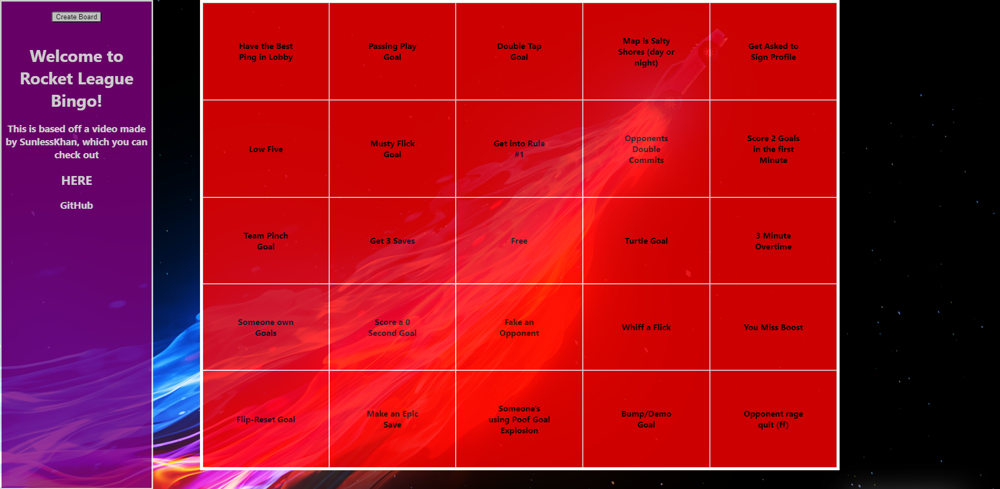
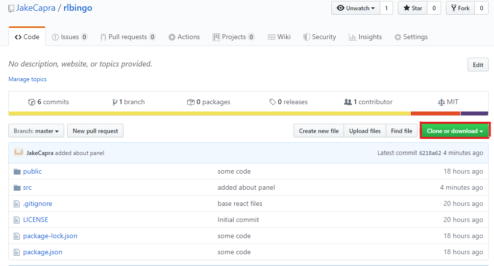
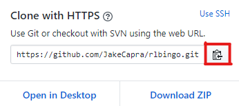

# Rocket League Bingo

This is Rocket League Bingo. I created this after I watched [this video](https://www.youtube.com/watch?v=-3aVf_LilUc) by SunlessKhan

## Installation

### Clone the Repo

1. Open Git Bash (or Command Prompt).

2. Cd to where you want the repo to go.

3. Git Clone the link you got from Github.

### Download Node.js
Download Node.js at this <a href="https://nodejs.org/en/">link</a>.

## Starting Rocket League Bingo

1. Open cmd.

2. If it is your first install you might need to run the command **npm install -g create-react-app**. 

3. Run the command **cd _repo path_**. 

**repo path** is where ever you cloned the repo.

4. Run the command **npm install**. Only once.

5. You might also need to run **npm install react-router-dom**. Only once.

6. Run the command **npm start**.

This should open a browser to localhost:3000.

If you close this tab you can just type localhost:3000 into the browser

## Notes
The background color if the tiles does not change when you create a new board, so you need to refresfh the page and generate a new board if you want to start over. Or you can toggle the color on each tile by clicking on it.
I don't ahve a lot of experince with react and web dev. in general, so it is not the best site, but I hope you enjoy it. 